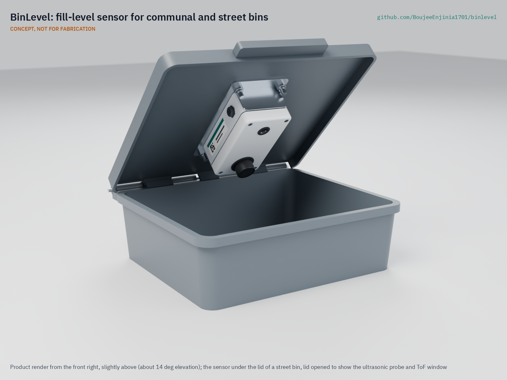

# BinLevel

     

**Area:** Smart Cities · **TRL:** 3 of 9 (proof of concept on paper) · **Prototype budget:** about $60 USD · **Difficulty:** 1 of 5

A fill-level sensor for public and communal bins that reports when bins need emptying so collection routes serve full bins, not empty ones.

[Exploded render](media/render-exploded.png) · [Detail render](media/render-detail.png) · [Interactive 3D model](media/viewer.html) · [Concept blueprint (PDF)](media/concept-blueprint.pdf) · [General arrangement BNL-DWG-001 (PDF)](cad/drawings/BNL-DWG-001.pdf) · [Sizing note](docs/04-calcs/01-sizing.md) · [Review note](docs/REVIEW.md)

## Concept rationale

A collection crew on a fixed timetable cannot tell a full bin from an empty one until it arrives. A small sensor under the lid that measures the distance down to the waste, and says so by radio a few times a day, gives the planner that knowledge before the truck leaves. BinLevel uses the same principle as commercial bin sensors (ultrasonic ranging, tilt and temperature) but adds a cheap time-of-flight sensor for the top of the bin, runs for a decade or more on one primary lithium cell (about 16 years in the worst radio case on paper), and sends only levels, never images or sound.

It is open and garage-buildable because the towns, campuses and community groups that most need better collection are least able to pay per-bin subscriptions for closed sensors. Every part is an off-the-shelf module in a stock enclosure, the payload format is documented, and it talks to any LoRaWAN network, including the lab's TwinKit gateway and The Things Network.

## Burning platform

The world produced about 2.56 billion tonnes of municipal waste in 2022, and the World Bank expects 3.86 billion tonnes by 2050 under business as usual ([World Bank, *What a Waste 3.0*](https://www.worldbank.org/en/publication/what-a-waste)). UNEP estimates the global direct cost of waste management at about USD 252 billion in 2020, rising to about USD 361 billion once the hidden costs of pollution, poor health and climate change are counted ([UNEP, 2024](https://www.unep.org/resources/global-waste-management-outlook-2024)).

The money does not reach everyone. Collection rates are as low as 31 % in Sub-Saharan Africa and 67 % in South Asia, and public spending on waste in most low- and middle-income countries is well below 0.15 % of GDP, against about 0.3 to 0.5 % needed for basic collection ([World Bank](https://www.worldbank.org/en/publication/what-a-waste)). With budgets this tight, a truck trip to a half-empty bin is a trip not made to an overflowing one.

## Where it could be used

### By industry

| Industry | Use |
| --- | --- |
| Municipal waste services and contractors | Plan daily routes around communal containers that are near full; confirm each emptying |
| Housing estates and property managers | Call for collection only when shared 660 to 1,100 L bins need it |
| Markets, ports and transport hubs | Watch high-turnover bins that fill unpredictably with trading and passenger peaks |
| Parks, beaches and tourism | Seasonal litter bins that sit empty in winter and overflow on summer weekends |
| Universities, hospitals and industrial sites | Campus bins and recycling points on private LoRaWAN networks |
| Recycling and deposit schemes | Glass, paper and textile banks that must be emptied before they overflow |

### By country or region

| Country or region | Why it matters there |
| --- | --- |
| Sub-Saharan Africa | Waste collection rates are as low as 31 % ([World Bank](https://www.worldbank.org/en/publication/what-a-waste)); sending scarce trucks to full communal points first stretches the service. |
| South Asia, including India | Collection rates are about 67 % ([World Bank](https://www.worldbank.org/en/publication/what-a-waste)); dense markets and housing produce fast, uneven fill that fixed timetables miss. |
| European Union | Each person generated about 517 kg of municipal waste in 2024 ([Eurostat](https://ec.europa.eu/eurostat/statistics-explained/index.php?title=Municipal_waste_statistics)); high labor costs make every avoided lift valuable. |
| England, United Kingdom | Councils dealt with 1.26 million fly-tipping incidents in 2024/25, 62 % of them household waste ([Defra](https://www.gov.uk/government/statistics/fly-tipping-statistics-for-england/fly-tipping-statistics-for-england-2024-to-2025)); clearing communal bins before they overflow helps keep side waste off the street. |
| United States | Americans generated 292.4 million tons of municipal waste in 2018, about 4.9 lb (2.2 kg) per person per day ([US EPA](https://www.epa.gov/facts-and-figures-about-materials-waste-and-recycling/national-overview-facts-and-figures-materials)); parks and campuses run large fleets of street bins. |

## What sparked the idea

The starting point was Philadelphia's 2009 rollout of 500 solar-powered BigBelly compactors, which replaced about 700 wire baskets on the promise that sensor-reported fullness would cut collections from 17 trips a week to five ([US EPA](https://archive.epa.gov/international/jius/web/html/bigbelly_trash_compactors.html)). In July 2010 City Controller Alan Butkovitz reported that collections averaged about 10 a week, that each compactor had cost about $3,700, and that the city had relied solely on the maker's claims without independent verification ([NBC10 Philadelphia](https://www.nbcphiladelphia.com/news/local/bigbelly-trash-compactors-a-big-fat-waste-of-money-controller/2140012/)). Both sides agreed that knowing how full a bin is saves trips; the dispute was over how much, and only the vendor held the data. BinLevel separates that knowledge from the bin: a sensor with about $55 of parts, roughly 1.5 % of the price of one of those compactors, that fits containers a city already owns, with an open payload so the city can check the savings itself.

## Problem

Fixed collection schedules empty half-full bins while others overflow. Cities and communities have no cheap, open way to know how full each bin is before the truck leaves.

## Concept

A sealed box under the bin lid measures the distance to the waste every 15 minutes with an ultrasonic transducer, backed by a time-of-flight sensor for the top of the bin. It sends fill level, temperature, emptying events and battery state in an 11-byte LoRaWAN uplink every hour (every 2 hours at SF12), or at once when the bin passes a set level (default 80 %). A primary lithium C cell lasts about 16 years in the worst radio case on paper, so the 10-year design life is set by seals and plastics. Parts cost $55.00 (indicative), within the $60 budget; the unit weighs about 334 g with a 2 mm aluminium bracket, inside its 400 g target. No camera, no microphone.

Full design precis: [docs/02-concept.md](docs/02-concept.md). Requirements, including those not yet met (IP69K washing and radio inside steel containers) and those at risk (accuracy on real waste and hot lids): [docs/03-requirements.md](docs/03-requirements.md). Sizing calculations: [docs/04-calcs/01-sizing.md](docs/04-calcs/01-sizing.md). Decisions by Amish: [docs/decisions/0001-trl2-review-decisions.md](docs/decisions/0001-trl2-review-decisions.md) and [docs/decisions/0002-recommendations-accepted.md](docs/decisions/0002-recommendations-accepted.md).

## Key components

- Stock IP67 enclosure on a 2 mm aluminium bracket, bolted under the lid with four stainless tamper-resistant M6 bolts
- Sealed 40 kHz ultrasonic transducer (main range, from about 0.25 m to the container floor)
- Near-range time-of-flight sensor (top 0.4 m of the bin, where the 80 % threshold lies)
- RAK3172 (STM32WL) LoRaWAN module, the same radio family as FieldNode
- Carrier board with accelerometer (emptying and lid events), temperature sensor and nanopower regulator
- Li-SOCl2 C cell, multi-year life
- Flexible antenna (external antenna for steel containers)

The working bill of materials is in [bom/bom.csv](bom/bom.csv).

## Safety

> The Li-SOCl2 cell is a primary lithium cell: never charge, short, crush or overheat it, fuse it, and recycle spent cells through a battery collection point, never in the bin. Bins hold sharp objects and biological waste: install and service sensors only on emptied, cleaned containers with cut-resistant gloves and eye protection, and deburr drilled lids. The temperature alert is a maintenance aid, not fire detection.

## Repository layout

| Folder | Contents |
| --- | --- |
| `docs/` | Problem, concept, requirements, calculations and design decisions |
| `cad/src/` | build123d Python source, the source of truth for all geometry |
| `cad/step/`, `cad/stl/` | Exported models for FreeCAD, other CAD tools and printing |
| `cad/drawings/` | 2D sketches and dimensioned drawings |
| `bom/` | Bill of materials |
| `electronics/` | KiCad schematics and PCB layouts |
| `firmware/` | Microcontroller code |
| `media/` | Renders, perspectives and photos |
| `build-log/` | Dated prototyping notes |

## Documentation

Controlled documents follow the portfolio [documentation standard](.kit/STANDARDS.md). Each carries a document ID (BNL-PRC-001 for the precis), a version and a revision history. Branded PDFs are built with `python .kit/render.py` and attached to GitHub Releases when a document is tagged, for example `BNL-PRC-001/v1.0`.

## Credits

Designed by Amish Chadha. See [CONTRIBUTORS.md](CONTRIBUTORS.md) for roles. To cite this design, use [CITATION.cff](CITATION.cff) (GitHub shows it as "Cite this repository").

AI assistance (Claude) was used to accelerate concept renders, prototype documentation and first-pass sizing calculations. Design direction and all decisions are Amish Chadha's, recorded in this repository's decision records (`docs/decisions/`).

## Licenses

- **Hardware** (CAD, drawings, BOM, electronics): [CERN-OHL-S v2](LICENSE)
- **Software** (firmware, scripts, notebooks): [MIT](LICENSE-SOFTWARE)

A project of the [Design Molecule](https://designmolecule.com) lab.
