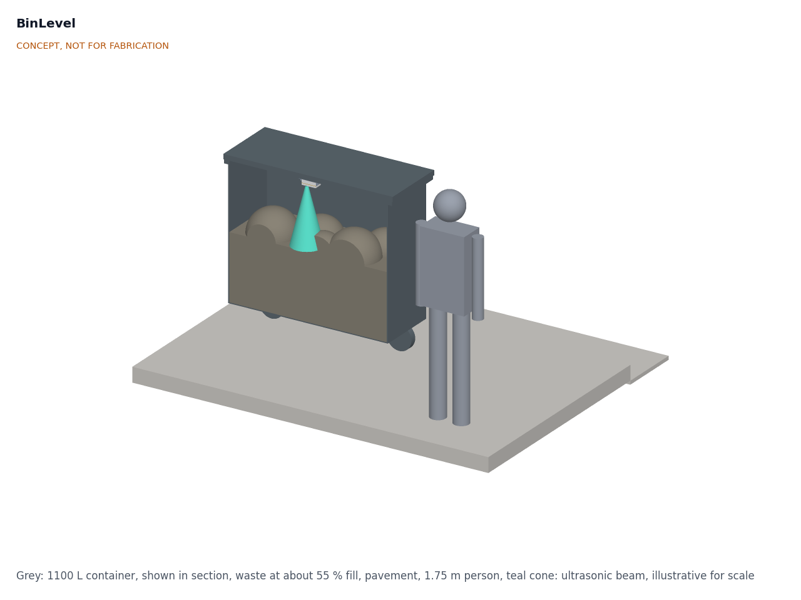
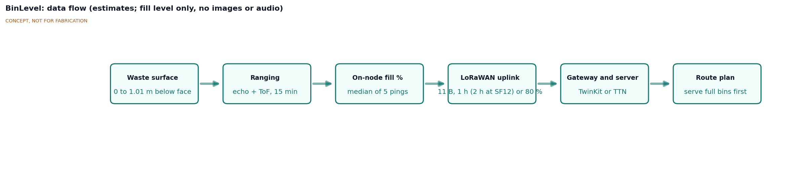
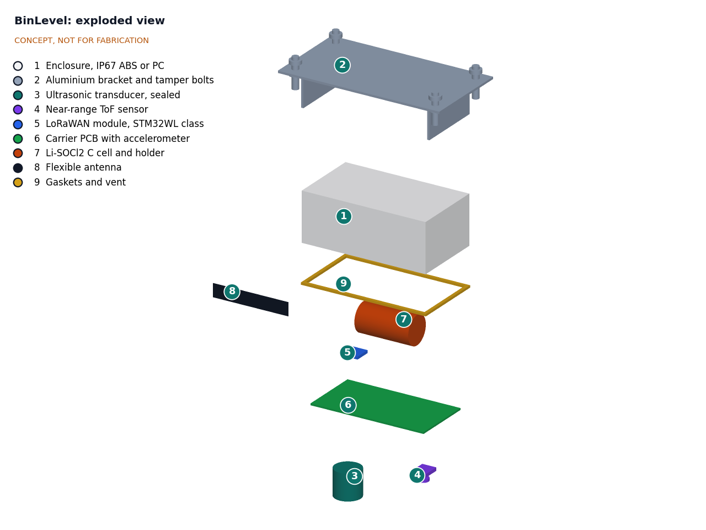
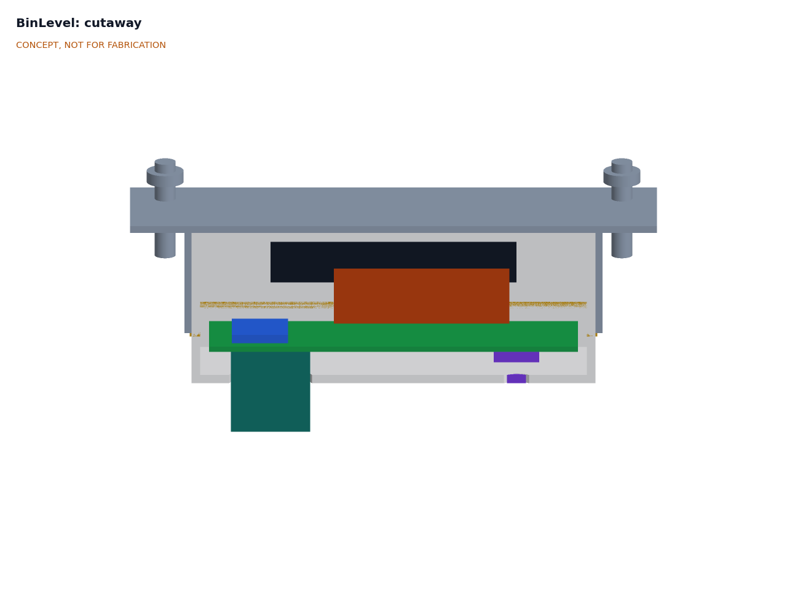

# BinLevel design precis

## Summary

BinLevel is a small sealed box bolted under the lid of a communal or public bin. Every 15 minutes it measures the distance down to the waste with a sealed ultrasonic transducer, backed by a time-of-flight (ToF) sensor for the top of the bin, and turns it into a fill percentage. It sends the level, temperature, tilt events and battery state by LoRaWAN every hour (every 2 hours at SF12), or at once when the bin passes a set level. A primary lithium C cell would last about 16 years in the worst radio case on paper, so seals and plastics, not the cell, set the 10-year design life. Parts cost is $55.00 (indicative), within the $60 budget, and the unit weighs about 334 g with its 2 mm aluminium bracket, inside the 400 g target (BNL-CAL-001). It carries no camera and no microphone.

## How it works

1. **Measure.** The microcontroller wakes every 15 minutes, switches on the ultrasonic transducer and takes five pings, then reads the ToF sensor. It keeps the median ultrasonic distance and uses the ToF reading when the surface is closer than the ultrasonic blind zone (about 0.25 m, estimate).
2. **Interpret.** Distance is converted to fill percentage against the empty depth stored at installation. A fill above the threshold (default 80 %) or an abnormal temperature, read every 5 min, triggers an immediate uplink. The heat rule is 70 °C, or a rise of 15 K in 15 min counted only while the unit is above 50 °C, so a sunny lid does not raise false alarms.
3. **Sense events.** A low-power accelerometer wakes the controller when the bin is tipped (emptying confirmed) or when the lid is opened (usage count), so the service gets proof of collection without a driver app.
4. **Report.** A LoRaWAN Class A uplink of 11 bytes carries fill %, raw distance, temperature, event counters and battery voltage. Any LoRaWAN network server can receive it: the lab's TwinKit gateway, The Things Network or a city network.
5. **Plan.** The server passes levels to a route planner, which schedules the bins that are full or will be full before the next round (Figure 2).

## Main components

Numbers match the exploded view (Figure 3) and `bom/bom.csv`. Main dimensions and interfaces are on the general arrangement drawing BNL-DWG-001 (`cad/drawings/BNL-DWG-001.pdf`), generated from `cad/src/model.py`.

| No. | Component | Role |
| --- | --- | --- |
| 1 | Enclosure, IP67 ABS or PC, about 115 x 65 x 45 mm | Protects electronics; holes for transducer and ToF window |
| 2 | Aluminium bracket, 2 mm 5052 class, and four stainless tamper-resistant M6 bolts on a 130 x 60 mm pattern | Fixes the unit under the lid; bolts pass through the lid |
| 3 | Sealed 40 kHz ultrasonic transducer (JSN-SR04T class) with driver | Main range sensor, about 0.25 to 1.5 m (estimate) |
| 4 | Near-range ToF sensor (VL53L1X class) behind a window | Top of bin and overfill, about 0.03 to 0.4 m (estimate) |
| 5 | LoRaWAN module, RAK3172 (STM32WL) | Controller and radio in one module, as in FieldNode |
| 6 | Carrier PCB with accelerometer, temperature sensor, nanopower regulator, load switch and buffer capacitor | Joins the parts; powers sensors only while measuring; keeps the module below 3.6 V |
| 7 | Li-SOCl2 primary cell, C size, 3.6 V, about 8.5 Ah nominal, with strapped holder and fuse | Multi-year energy store |
| 8 | Flexible 868/915 MHz antenna | Radio antenna inside the enclosure (external option for steel bins) |
| 9 | Gaskets, vent membrane and transducer seal | Keeps water and condensation out |

## First-order numbers

The numbers below are from the sizing note BNL-CAL-001, which checks every requirement against the parametric model `cad/src/model.py`. They are paper estimates, not measurements.

### Energy budget

Sleep current is 6.0 µA for the whole unit (module 2.0 µA, accelerometer 2.0 µA, temperature sensor 0.5 µA, regulator and leakage 0.5 µA, buffer capacitor 1.0 µA). Each ranging cycle takes 7.5 mAs; each uplink transmits at +14 dBm at an assumed 45 mA. Usable capacity is taken as 60 % of nominal, with self-discharge of 1 % of nominal a year.

Table 1. Daily charge use and life, with two alert uplinks a day (BNL-CAL-001, section C).

| Item | SF9, hourly uplink | SF12, uplink every 2 h |
| --- | --- | --- |
| Sleep (6.0 µA x 24 h) | 0.144 mAh | 0.144 mAh |
| Ranging (96 cycles) and temperature reads | 0.201 mAh | 0.201 mAh |
| Uplinks | 0.086 mAh (26 x 0.21 s airtime) | 0.278 mAh (14 x 1.48 s airtime) |
| Self-discharge (C cell) | 0.233 mAh | 0.233 mAh |
| **Total** | **0.664 mAh per day** | **0.856 mAh per day** |
| Life on C cell (5.1 Ah usable) | 21.0 years | 16.3 years |
| Life on AA cell (1.56 Ah usable) | 8.5 years | 6.2 years |

The cell is not the limit on life; seals, the transducer membrane and the enclosure plastic under UV and heat are. The design target is therefore stated as 10 years (R4). The AA cell would meet the 5-year minimum but not the 10-year target, which is why the C cell is adopted (DDR-001, D3).

A fresh Li-SOCl2 cell rests at 3.67 V, above the RAK3172 module's 3.6 V maximum ([RAK3172 datasheet](https://docs.rakwireless.com/product-categories/wisduo/rak3172-module/datasheet/)), so the carrier includes a nanopower 3.3 V regulator. The cell carries the transmit pulse; a 1,000 µF low-leakage capacitor covers the voltage delay of a passivated cell.

### Radio airtime

The payload is 11 bytes (it was 12 at TRL 2), so that it fits the 11-byte limit of the slowest US915 data rate. It takes about 0.21 s at SF9 and about 1.48 s at SF12 (125 kHz). Hourly uplinks with two alerts use about 5.4 s per day at SF9, well inside TTN's 30 s daily fair use, but 38.6 s at SF12, which would exceed it. SF11 hourly uses 21.4 s. The firmware therefore stretches the routine interval to 2 hours at SF12 only (20.8 s per day) and keeps threshold alerts immediate (DDR-001, D6, as refined by DDR-002).

### Link

With a 10 dB fade margin and an urban path-loss model, a sensor in an HDPE container reaches a gateway about 0.8 km away at SF9 and 1.3 km at SF12. Inside a steel container the range falls to about 0.35 km even at SF12; an external lid antenna restores 1.3 to 2.1 km. Whether to offer that antenna or to leave steel containers out of the first pilot is open (DDR-001, O1).

### Measurement

- The transducer face is 1.01 m above the floor of an 1,100 L container. At 80 % fill the surface is 0.20 m below the face, inside the ultrasonic blind zone (about 0.25 m, estimate), which is why the ToF sensor covers the top 0.4 m. The two sensors overlap between 60 % and 75 % fill.
- The instrument error, with speed of sound compensated from the on-board temperature, is about 10 mm for the ultrasonic sensor and 20 mm for the ToF sensor, against the ±101 mm (±10 % of depth) accuracy target. Accuracy on real waste is limited by the surface, not by the sensor.
- An ultrasonic beam of 15° half-angle (assumed) covers a patch about 0.54 m across at the floor. Mounted at the lid center, the beam clears the walls for half-angles up to about 26°.
- The temperature is read every 5 min (not only with each 15 min ranging), so a heat alert reaches the server within about 7.5 min.

### Mass and cost

- Mass about 334 g: enclosure 74 g, 2 mm aluminium bracket 83 g, bolts and nuts 48 g, cell and holder 58 g, transducer, PCB, module and small parts about 72 g. This is inside the 400 g limit of R16. The 1.5 mm stainless bracket of BNL-PRC-001 v0.3 weighed 183 g and made the unit about 435 g; Amish chose the aluminium bracket on 2026-09-25 (DDR-002).
- Envelope below the lid 150 x 80 x 61.5 mm.
- Parts cost $55.00 at prototype quantities (indicative prices; see `bom/bom.csv`), inside the $60 budget. The gateway is shared across many bins and not included.

## Key design choices (decided by Amish, 2026-09-25)

Each choice below was decided by Amish on 2026-09-25 (go with recommendation) and is recorded in [decisions/0001-trl2-review-decisions.md](decisions/0001-trl2-review-decisions.md) (BNL-DDR-001) and [decisions/0002-recommendations-accepted.md](decisions/0002-recommendations-accepted.md) (BNL-DDR-002).

1. **Ultrasonic plus ToF, rather than ultrasonic alone or ToF alone (D2).** Ultrasonic tolerates dust and dirt on the face and is the method used by commercial bin sensors ([Sensoneo](https://www.sensoneo.com/products/ultrasonic-bin-sensor/)). Low-cost sealed transducers cannot see the top 0.25 m, where the full threshold lies, so a ToF sensor covers that zone for about $5.
2. **Lid underside mounting (D8).** Keeps the unit out of the waste, out of sight and away from vandals. The cost is that lid opening moves the sensor, which the accelerometer detects and skips.
3. **Primary Li-SOCl2 C cell, not rechargeable or solar (D3).** No charging electronics, no panel to break on a tipped bin, and very low self-discharge.
4. **LoRaWAN on an STM32WL-class module (D4).** The RAK3172 shares the radio core and firmware approach adopted for FieldNode, so decoders and gateway set-up are common. The RAK3172-T variant (-40 to 85 °C) is named for sites colder than -20 °C (DDR-002). NB-IoT would avoid gateways but needs a SIM subscription per bin.
5. **Stock enclosure at TRL 2 to 3 (D9).** Keeps the build garage-friendly; a potted or IP69K design is a later option.
6. **Relationship to FieldNode and TwinKit (D5).** BinLevel does not use the FieldNode enclosure, panel or LiFePO4 cell: at $126 the FieldNode core costs more than twice the BinLevel budget and would not fit under a lid. It reuses FieldNode's radio module family, payload conventions and decoder so both sit on the same TwinKit gateway.
7. **First target container (D1), thresholds (D6) and temperature alert (D7).** The 660 to 1,100 L communal container is the design case; the default fill threshold is 80 %, the routine interval 1 h (2 h at SF12 only, DDR-002), and the heat alert 70 °C or a 15 K rise in 15 min. BNL-CAL-001 found that the ungated rate-of-rise trigger could fire when sun breaks through cloud, so under DDR-002 the rise counts only above 50 °C; the requirement R6 upper limit is also raised to 70 °C to match hot dark lids.
8. **Aluminium bracket (DDR-002).** A 2 mm 5052-class aluminium plate replaces 1.5 mm stainless, taking the unit from about 435 g to 334 g so that it meets R16. The bolts stay stainless; galvanic isolation between them and the plate (anodizing or insulating washers) is a review suggestion, not yet applied.

## Safety

> **Safety:** The Li-SOCl2 cell is a primary lithium cell with high energy density. Never charge it, short it, crush it or heat it above its rated limit; a damaged cell can vent toxic, corrosive gas or catch fire. Fit a fuse or PTC in series, use a holder that prevents reverse insertion, and dispose of spent cells through a battery recycler, never in the bin itself.

> **Safety:** Bins can hold sharp objects, needles, broken glass and biological waste. Fit and service sensors only on emptied and cleaned containers, wear cut-resistant gloves and eye protection, and keep drill swarf out of the container. Drilling a lid leaves sharp edges; deburr them.

> **Safety:** Bins can catch fire from hot ash or discarded batteries. The temperature alert in R9 is a maintenance aid and must not be relied on as fire detection. The unit itself contains a lithium cell, which adds fuel to a bin fire.

> **Safety:** Keep clear of the lifting mechanism of collection trucks when installing or testing on containers in service.

## Open questions

- [ ] Can a sealed low-cost transducer survive years of condensation and food acids, or is a potted industrial transducer needed?
- [ ] Does the ToF window fog or foul too quickly to be useful? A heater is ruled out (a 20 mW heater would use 156 times the energy budget, BNL-CAL-001); is a hydrophobic coating or a wiper enough?
- [ ] What is the real link loss inside HDPE and steel containers? BNL-CAL-001 assumes 10 dB and 30 dB; the steel-container choice is open (BNL-DDR-001, O1).
- [ ] Is IP67 enough for the first partner's washing practice?
- [ ] Which route planner and data layer should the pilot use (TwinKit, a city system or an open-source vehicle routing tool)?
- [ ] Should the payload also carry a rolling fill-rate estimate so the planner can predict the full time?
