# BinLevel prototype build plan

**Plan, not yet built.** How to build the first proof-of-concept prototype, component by component. Building and testing to it is TRL 4 work. Decisions still to be made are kept in the design decisions register ([docs/06-design-decisions.md](06-design-decisions.md)), not here.

## 1. What you are building

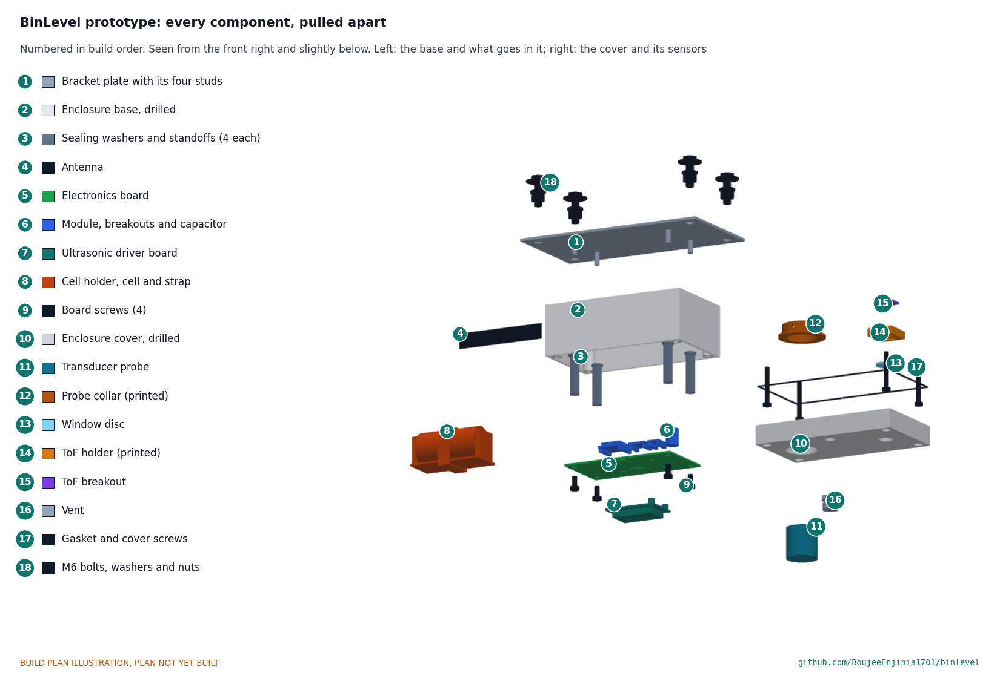

*Figure 1. Every component pulled apart and numbered in build order. The base and what goes in it are on the left, the cover and its sensors on the right.*

The prototype is one BinLevel sensor unit and a short length of bin lid to bolt it to: a small grey plastic box that hangs under the lid from a flat aluminium plate. The box's deep half (the base) is fixed to the plate and holds the electronics board, the cell and the antenna; its shallow half (the cover) faces down into the bin and carries the ultrasonic transducer, the window for the near-range light sensor and a breather vent. Figure 1 shows the 18 components in the order you make or fit them. Five are made or worked in a small workshop: the plate (cut, drilled and fitted with pressed-in studs), the two halves of a bought box (drilled), the electronics board (a cut and drilled prototyping board) and two small 3D-printed mounts for the sensors. Everything else is bought and fitted: the box, transducer and its driver board, light sensor, radio module, cell and holder, antenna, vent, standoffs and fixings. The work is cutting and drilling thin aluminium and plastic, one press fit, two small prints, bonding with epoxy and silicone, and soldering bought breakout boards together. The parts cost about $59 from the bill of materials.

> **Safety:** The prototype holds a primary lithium thionyl chloride cell (3.6 V, about 30 Wh). It must never be charged, shorted, crushed or heated; a damaged cell can vent toxic, corrosive gas or catch fire. Keep it out of the holder until safety stop S3 (section 6), and never connect a bench supply to the board while the cell is in. Cut aluminium edges are sharp: deburr everything. Printing ASA and curing epoxy give off fumes; work in a ventilated space. Fitting to a real bin is outside this plan; bins hold sharps and biological waste.

## 2. What changed to make it buildable

The concept showed what the unit does; some of its parts could not be made or fixed as drawn. Each change below keeps what the unit does, and all of them are recorded in decision record BNL-DDR-003, open for Amish's review.

*Table 1. Changes from the concept.*

| Component | The concept had | The buildable design has | Why |
| --- | --- | --- | --- |
| Box to plate | Two tabs folded down from the plate beside the box ends, with nothing holding the box; the tabs could not be folded from a flat blank | No tabs. Four studs pressed into the plate pass through the box floor; a sealing washer and a standoff on each one clamp the box to the plate (Figure 4) | The plate stays flat against the lid, the box stays sealed, and the standoffs also carry the board |
| Tamper bolts | Bolts 40 mm long, sticking 24 mm out below the nuts; the nuts drawn inside the plate | Bolts 20 mm long, a sealing washer under each head on the lid, a washer and locking nut under the plate (Figure 19) | Right length for the lid and plate; the nut sits 1.5 mm clear of the box |
| Box height | 45 mm tall, with no room for the transducer's driver board | 55 mm tall; the driver board hangs under the electronics board (Figure 10) | The driver board is part of the bought transducer kit; the unit is still well inside its size limit |
| Electronics board | A full-size board floating at mid height, clashing with the box's corner screw towers and touching the transducer | A 90 x 50 mm prototyping board on the four standoffs, 10 mm above the transducer (Figure 9) | It has a fixing, clears the towers and stands in for the circuit board, whose layout is later work |
| Transducer | Pushed into its hole with nothing holding it | A printed collar bonded inside the cover, with a clamp screw; silicone seals the hole (Figure 16) | Holds it at the right depth without more holes in the box |
| Light sensor window | A plug in the hole, and the sensor board floating above it | A printed holder bonded over the hole, holding a window disc and the sensor board (Figure 18) | The window seals from inside, so water pressure pushes it onto its seat |
| Vent, gasket, cell | Vent missing from the model; gasket drawn outside the box walls; cell floating with no holder | Vent in the cover facing down; gasket in the base rim groove; cell in a holder with a strap through the board (Figures 11 and 14) | Every part has a place and a fixing |
| Sensor leads | No way to take the cover off | Plugs on the transducer cable and the light sensor lead | The cover comes away from below for service |

## 3. Making the components

Make and check each component before the assembly step that needs it. Sizes are in millimetres. "Front" is the long side of the unit that faces you when you stand at the bin; "left" and "right" are as seen from the front. The unit hangs upside down compared with most boxes: the plate is on top and the cover faces down. Workshop tolerance is 0.5 mm unless a step says otherwise; drawings do not carry tolerances before TRL 4.

### 3.1 Bracket plate

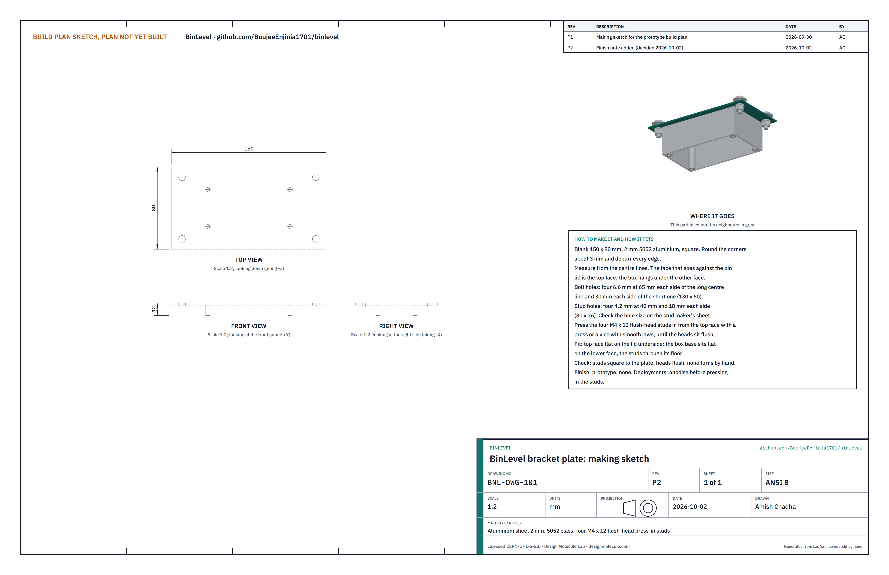

*Figure 2. Bracket plate making sketch (BNL-DWG-101).*

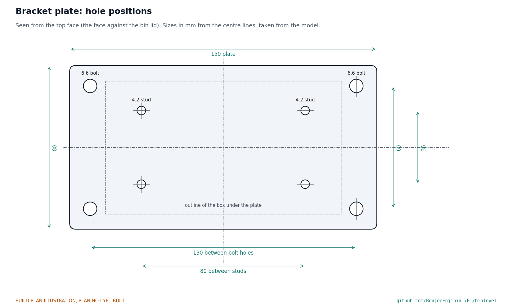

*Figure 3. Hole positions, measured from the two centre lines, with the outline of the box under the plate.*

**What it is and what it is made from.** The flat plate that sits against the underside of the bin lid and carries the box. Aluminium sheet 2 mm thick, 5052 class, 150 x 80 mm, with four M4 x 12 flush-head press-in studs.

**How to make it.**

1. Cut the blank to 150 x 80 mm, square. Round the corners to about 3 mm and deburr every edge.
2. Scribe both centre lines. Choose one face as the top (the face against the lid) and mark it.
3. Bolt holes: four 6.6 mm holes, 65 each side of the short centre line and 30 each side of the long one (130 x 60 apart).
4. Stud holes: four 4.2 mm holes, 40 each side and 18 each side (80 x 36 apart). Check the hole size against the stud maker's data sheet before drilling.
5. Deburr every hole on both faces.
6. Press the four studs in from the top face, with an arbor press or a vice with smooth jaws, until each head sits flush with the top face.

**How it fits the parts next to it.**

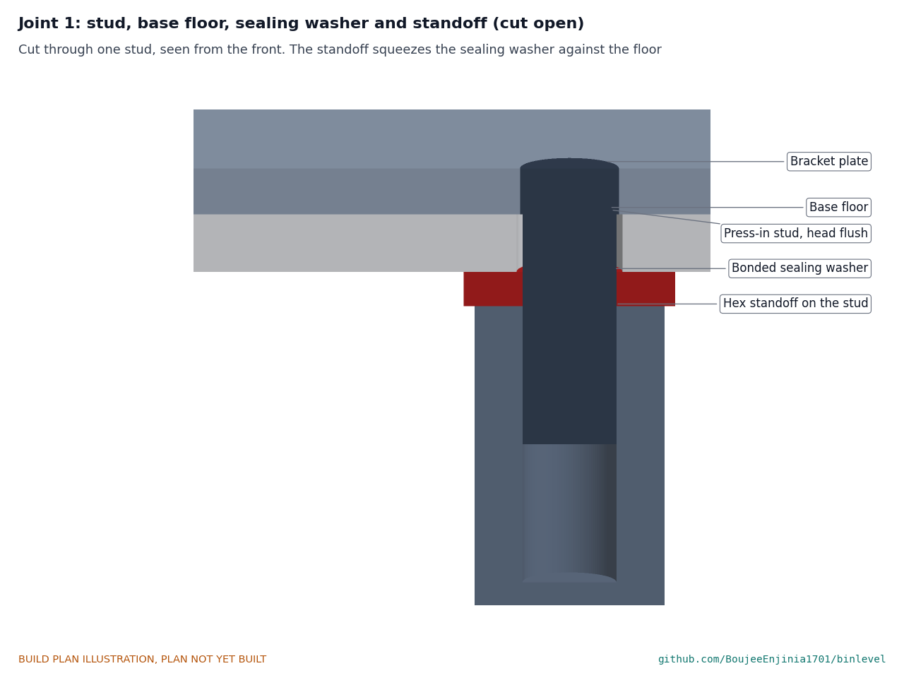

*Figure 4. Each stud passes through the box floor; inside, a bonded sealing washer and a hex standoff clamp the floor to the plate.*

The top face lies flat on the underside of the bin lid. The box base sits flat on the lower face, centred, with the four studs through its floor. The bolt holes stand clear of the box ends by 1.5 mm at the washers.

**Check before moving on.** The studs stand square to the plate, their heads are flush with the top face, and none turns when you twist it with pliers.

### 3.2 Enclosure base, drilled

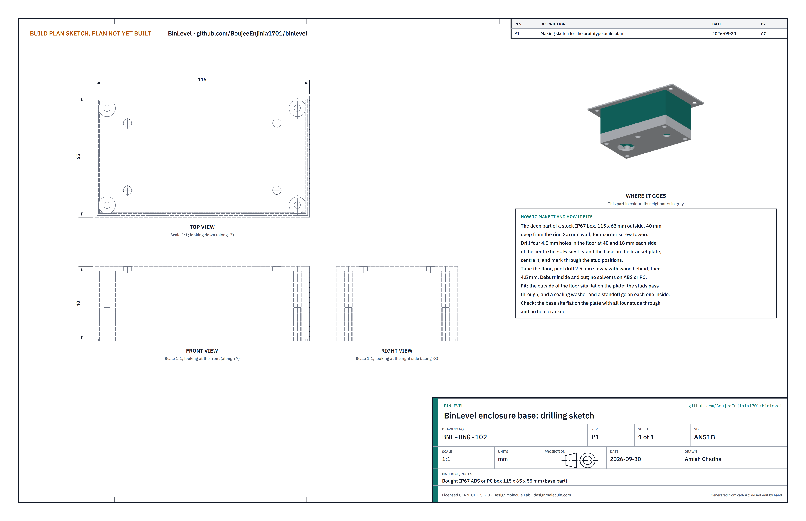

*Figure 5. Enclosure base drilling sketch (BNL-DWG-102).*

**What it is and what it is made from.** The deep half of a bought IP67 box, 115 x 65 x 55 mm outside with a 2.5 mm wall, ABS or polycarbonate, with four corner screw towers for the cover screws. Four holes are drilled in its floor.

**How to make it.**

1. Stand the base on the lower face of the plate, centred, and mark the floor through the four stud positions (or measure 40 and 18 each side of the centre lines).
2. Cover the floor with masking tape. Put a block of wood behind it, pilot drill 2.5 mm at low speed, then open each hole to 4.5 mm. Do not centre punch hard; the plastic can crack.
3. Deburr inside and out, peel the tape and clean with water and mild soap only; solvents craze polycarbonate.

**How it fits the parts next to it.** The outside of the floor sits flat on the plate with the four studs through it. Inside, a bonded sealing washer (rubber side to the floor) and a 30 mm hex standoff go on each stud (Figure 4); the standoffs pull the floor onto the plate and later carry the electronics board.

**Check before moving on.** The base sits flat on the plate with all four studs through, and no crack runs from any hole under a bright lamp.

### 3.3 Electronics board

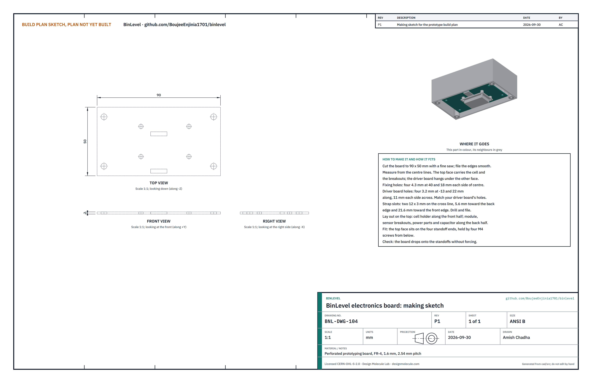

*Figure 6. Electronics board making sketch (BNL-DWG-104).*

**What it is and what it is made from.** The board that carries the cell, the radio module and the small electronic parts, and has the transducer's driver board hanging under it. For the prototype it is a perforated prototyping board (glass-fibre, 1.6 mm, 2.54 mm hole pitch) standing in for the custom circuit board, whose layout is later work.

**How to make it.**

1. Cut the board to 90 x 50 mm with a fine saw and file the edges smooth.
2. Scribe the two centre lines. The face that will carry the cell is the top face; the long edge that will face the front of the unit is the front edge.
3. Fixing holes: four 4.3 mm holes, 40 each side and 18 each side of centre.
4. Driver board holes: four 3.2 mm holes at 13 mm left and 22 mm right of centre, 11 each side of the long centre line. Hold your driver board on the board and adjust these to its own holes.
5. Strap slots: two slots 12 x 3 mm on the short centre line, centred 5.6 mm toward the back edge and 21.6 mm toward the front edge. Drill a row of 1.5 mm holes and file each slot square.
6. Lay out the parts as Figure 7 shows: the cell holder along the front half, the radio module, sensor breakouts, power parts and capacitor along the back half. Solder each on its pins.
7. Fit the driver board under the board on four 4 mm nylon standoffs and M3 nylon screws, its parts facing down (Figure 10).
8. Wire everything as Figure 8 shows (section 3.3.1).

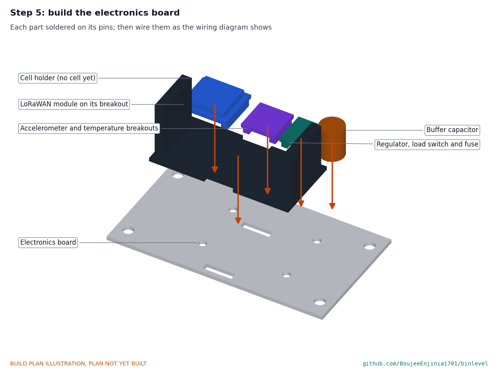

*Figure 7. Where each part goes on the top face of the board.*

#### 3.3.1 Wiring

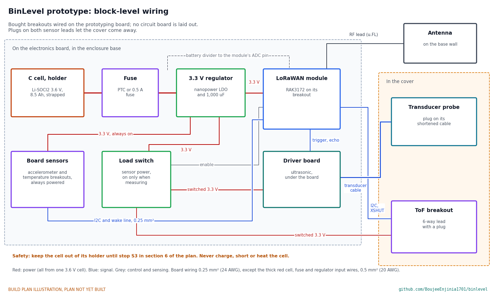

*Figure 8. Block-level wiring with wire sizes. No circuit board is laid out at this stage; bought breakouts stand in for it.*

*Table 2. Parts on the electronics board.*

| Part | What to buy or fit |
| --- | --- |
| Radio module | RAK3172 (RAK3172-T for sites colder than -20 °C) on its maker's breakout board, with a u.FL antenna socket |
| Board sensors | Three-axis accelerometer breakout with a wake-on-motion output (LIS2DH12 class) and a low-power temperature sensor breakout |
| 3.3 V regulator | Nanopower low-dropout regulator, 3.3 V out, quiescent current under 1 µA, at least 100 mA |
| Buffer capacitor | 1,000 µF low-leakage electrolytic or polymer capacitor, 6.3 V or more, across the regulator input |
| Load switch | Low-leakage load switch with an enable input, feeding the driver board and the light sensor only while measuring |
| Fuse | Resettable fuse or 0.5 A fuse in the cell lead |
| Battery divider | Two resistors of about 1 MΩ, switched by the module, from the fused cell lead to an analog input |
| Plugs | Two-way plug for the transducer cable (the driver board's own) and a six-way plug for the light sensor lead |

Wire it like this, with ferrules or solder on every joint:

1. Cell holder to the fuse, and the fuse to the regulator input: 0.5 mm² (20 AWG).
2. Regulator output (3.3 V) to the radio module, the board sensors and the load switch input: 0.25 mm² (24 AWG).
3. Load switch output to the driver board supply and to the light sensor plug: 0.25 mm².
4. Radio module to the load switch enable, the driver board's trigger and echo pins, the board sensors (I2C and the wake line) and the light sensor plug (I2C and its shut-down line): 0.25 mm².
5. Battery divider from the fused cell lead to the module's analog input.
6. Antenna lead from the module's u.FL socket to the antenna on the base wall, away from the power wires.

**Check before moving on.** Every wire continues end to end; with no cell in the holder, the cell terminals read open to every rail; every lead and plug is labelled.

**How it fits the parts next to it.**

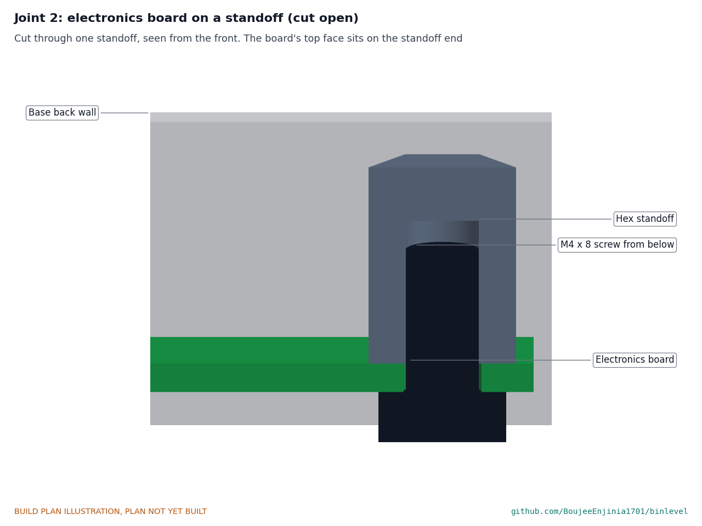

*Figure 9. The board's top face sits on the end of each standoff, held by one M4 x 8 screw from below.*

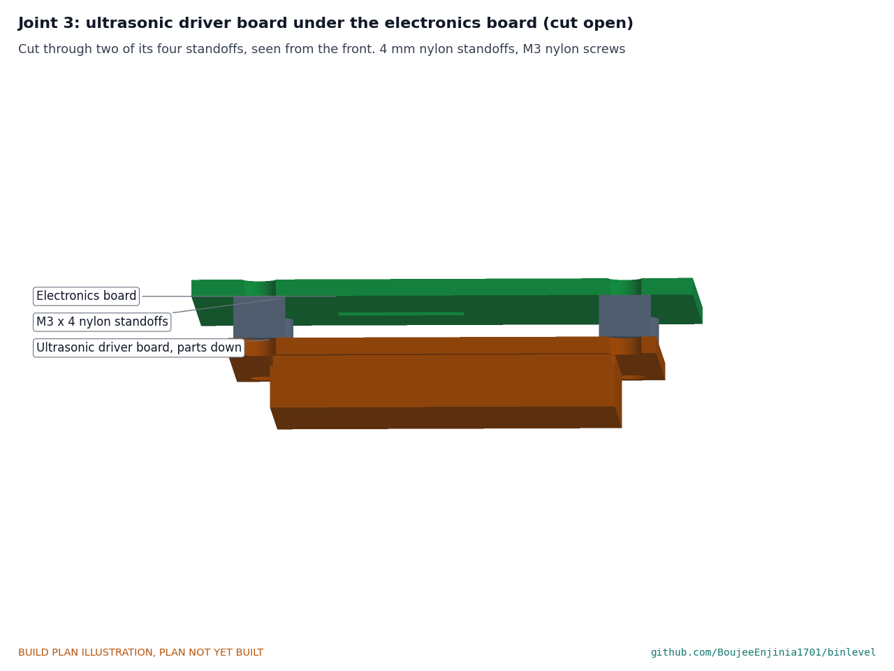

*Figure 10. The driver board hangs 4 mm under the electronics board on nylon standoffs, its parts facing down, clear of the transducer and the light sensor holder.*

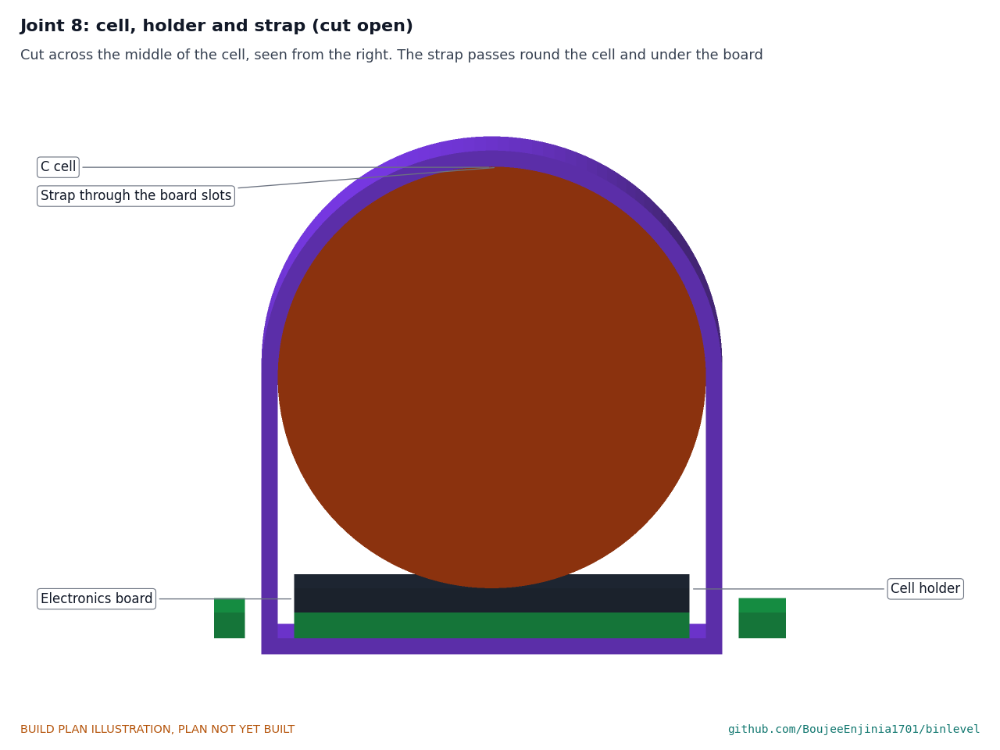

*Figure 11. The strap passes round the cell, through the holder base and the board slots, and under the board.*

The board hangs 31.5 mm below the inside of the box floor, with 1.6 mm between its corners and the box's screw towers. The cell clears the box floor by 3.8 mm, and the transducer sits 10 mm below the board.

**Check before moving on.** The board drops onto the four standoffs without forcing, and the driver board does not touch anything below it when the cover is offered up.

### 3.4 Enclosure cover, drilled

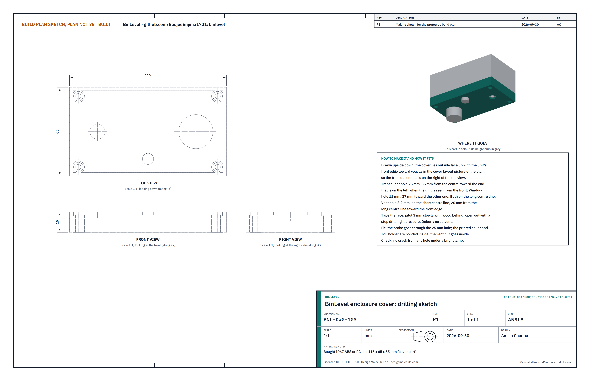

*Figure 12. Enclosure cover drilling sketch (BNL-DWG-103), drawn upside down so the top view shows the outside of the floor.*

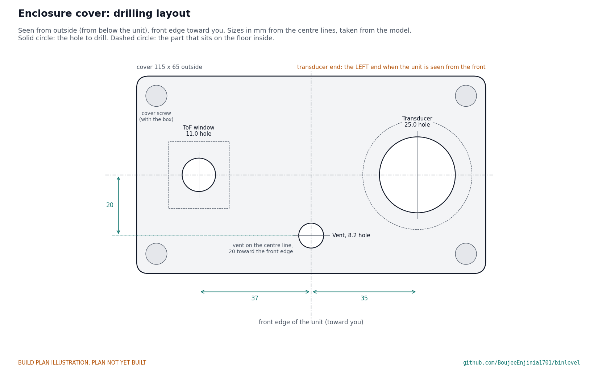

*Figure 13. Drilling layout, seen from outside with the front edge toward you. The transducer end is on your right here; it is the left end when the unit hangs under the lid and you see it from the front.*

**What it is and what it is made from.** The shallow half of the same bought box, 15 mm deep, with its four corner cover screws. Three holes are drilled in its floor.

**How to make it.**

1. Lay the cover outside face up, front edge toward you. Cover the floor with masking tape and scribe both centre lines.
2. Mark the holes from Figure 13: the transducer hole 25 mm across, 35 right of centre on the long centre line; the window hole 11 mm across, 37 left of centre on the same line; the vent hole 8.2 mm across, on the short centre line, 20 toward you.
3. Put a block of wood inside under the floor. Pilot drill each hole 3 mm at low speed, then open it with a step drill and light pressure. Check the transducer hole against your probe before the last step: it should be 1 mm larger than the probe.
4. Deburr inside and out and clean with water and mild soap only.

**How it fits the parts next to it.** The transducer, its collar, the window holder and the vent fit in the cover (sections 3.5 and 3.6, steps 9 to 11). The cover rim closes onto the gasket in the base rim groove, pulled up by the four corner screws:

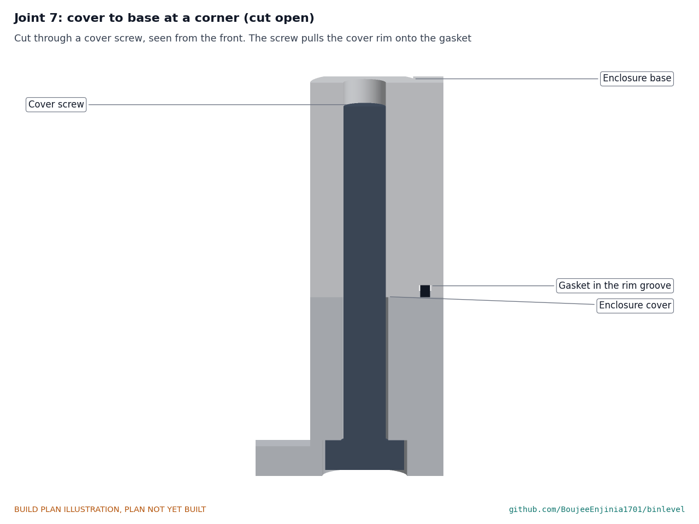

*Figure 14. Each cover screw passes up through a tower in the cover into a tower in the base, pulling the cover rim onto the gasket.*

**Check before moving on.** No crack runs from any hole, and the cover still closes on the base with all four screws.

### 3.5 Probe collar

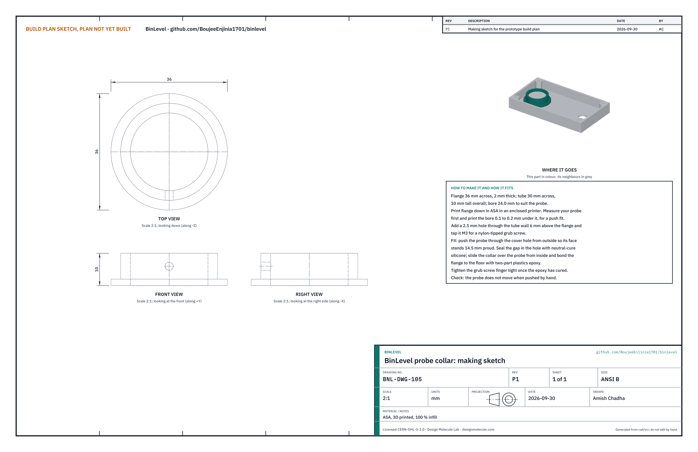

*Figure 15. Probe collar making sketch (BNL-DWG-105).*

**What it is and what it is made from.** A short printed sleeve that holds the transducer probe at the right depth inside the cover. ASA plastic, printed at 100 % infill in an enclosed printer.

**How to make it.**

1. Measure your probe's diameter. The model assumes 24 mm.
2. Print the collar flange down: a flange 36 mm across and 2 mm thick, a tube 30 mm across and 10 mm tall overall, and a bore 0.1 to 0.2 mm smaller than the probe, for a push fit. Let it cool on the bed.
3. Drill a 2.5 mm hole through the tube wall, 6 mm above the flange, on the side that will face the front, and tap it M3.

**How it fits the parts next to it.**

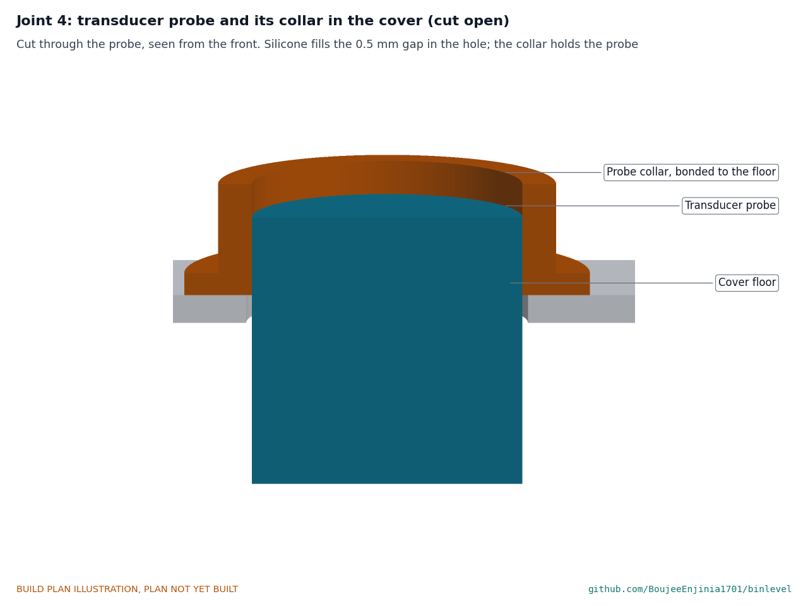

*Figure 16. The probe passes through the 25 mm hole, its face 14.5 mm proud of the cover; silicone fills the 0.5 mm gap; the collar flange is bonded to the floor and its screw clamps the probe.*

**Check before moving on.** The collar slides onto the probe with hand pressure and does not rock.

### 3.6 Light sensor holder and window

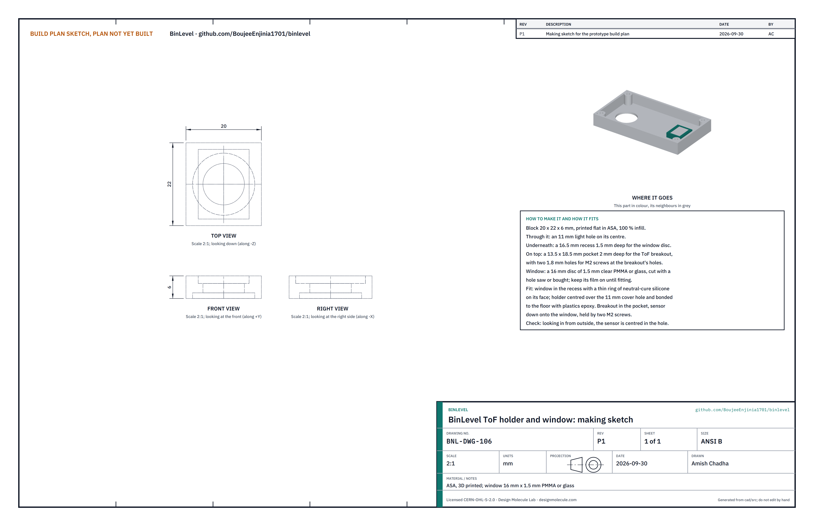

*Figure 17. Light sensor (ToF) holder and window making sketch (BNL-DWG-106).*

**What it is and what it is made from.** A small printed block that holds a clear window disc over the 11 mm hole and the light sensor breakout just above it. ASA plastic, 100 % infill; the window is a 16 mm disc of 1.5 mm clear PMMA or glass.

**How to make it.**

1. Print the block 20 x 22 x 6 mm, flat, with an 11 mm light hole through its centre, a 16.5 mm recess 1.5 mm deep underneath for the window, and a 13.5 x 18.5 mm pocket 2 mm deep on top for the breakout. Adjust the pocket to your breakout's size and add two 1.8 mm holes at its mounting holes.
2. Cut the window disc with a hole saw at low speed, or buy a 16 mm disc. Keep its protective film on until fitting.

**How it fits the parts next to it.**

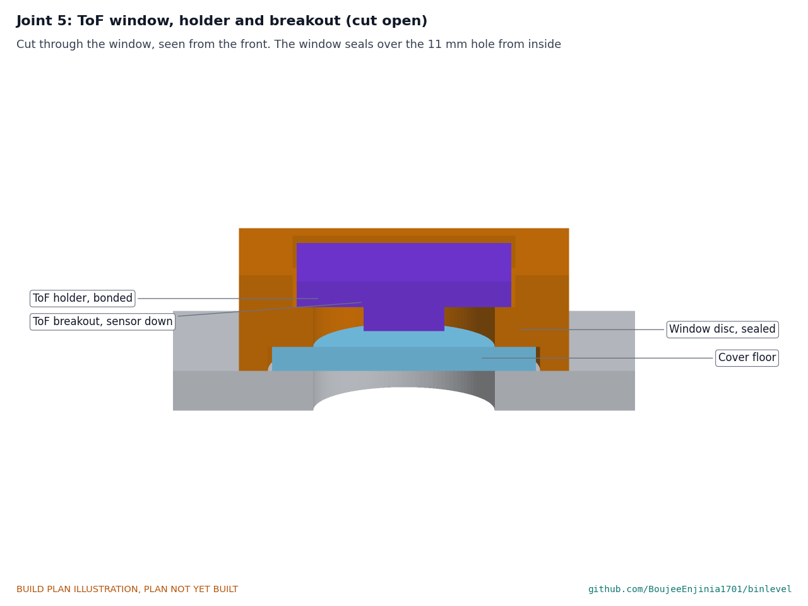

*Figure 18. The window sits in the holder's recess on the cover floor over the 11 mm hole; the breakout sits in the top pocket, sensor facing down onto the window.*

**Check before moving on.** Looking in through the hole from outside, the sensor is centred and the window is clean.

### 3.7 Bought components

Buy to specification, not brand. Line numbers are those of the bill of materials.

- **Enclosure (line 1).** IP67 ABS or polycarbonate box 115 x 65 x 55 mm outside, 2.5 mm wall, a 15 mm deep screw-down cover with gasket and four corner screws.
- **Bolts, washers and nuts (line 2).** Four stainless M6 x 20 tamper-resistant button-head bolts with their driver, four 18 mm sealing washers, four M6 plain washers and four M6 nyloc nuts.

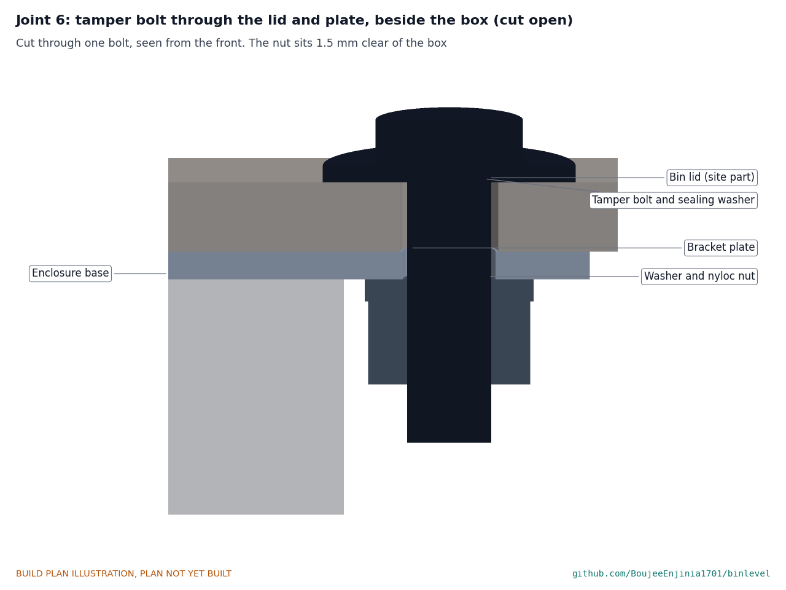

*Figure 19. The bolt passes down through its sealing washer, the lid and the plate; the washer and nut sit under the plate, 1.5 mm clear of the box.*

- **Transducer and driver board (line 3).** Sealed 40 kHz waterproof ultrasonic transducer, 3.3 V capable (JSN-SR04T class), 24 mm probe, with its driver board of about 41 x 28 mm. Shorten the probe cable to about 0.15 m and refit its plug.
- **Light sensor (line 4).** VL53L1X laser ranging breakout, about 13 x 18 mm, sensor on the underside.
- **Radio module (line 5).** RAK3172 on its maker's breakout, built for the band of the pilot region.
- **Electronics parts (line 6).** As Table 2, with the perforated board.
- **Cell, holder and strap (line 7).** C size lithium thionyl chloride cell (ER26500 class), 3.6 V, about 8.5 Ah, rated for pulses of at least 100 mA, from a maker that publishes a data sheet; a through-board holder; a 10 mm hook-and-loop strap.
- **Antenna (line 8).** Flexible 868/915 MHz adhesive antenna with a u.FL lead.
- **Vent (line 9).** M8 ePTFE pressure-equalising vent with its nut.
- **Box fixings (line 10).** Four M4 x 12 flush-head press-in studs for aluminium sheet; four M4 x 30 aluminium hex standoffs, female both ends, 7 mm across flats; four M4 bonded sealing washers; four M4 x 8 pan-head screws; four M3 x 4 nylon standoffs with M3 nylon screws; one M3 x 4 nylon-tipped grub screw.
- **Printed mounts and window (line 11).** ASA filament, the window disc, two-part epoxy for plastics and neutral-cure silicone sealant.
- **Test lid.** A piece of 5 mm HDPE sheet about 220 x 140 mm, drilled with the plate as a template, stands in for the bin lid.

## 4. Putting it together

In each picture the parts already fitted are grey and the parts being fitted are in colour, with an arrow showing the way they go in. Several pictures look up from below, because the unit hangs under the lid.

### Step 1: press the studs into the plate

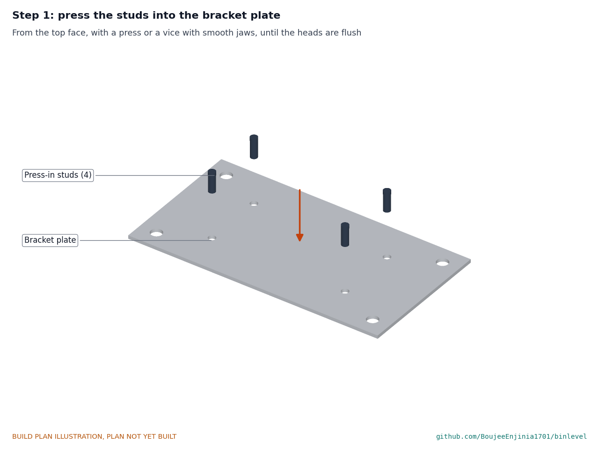

From the top face, until the heads are flush (section 3.1).

### Step 2: base onto the plate

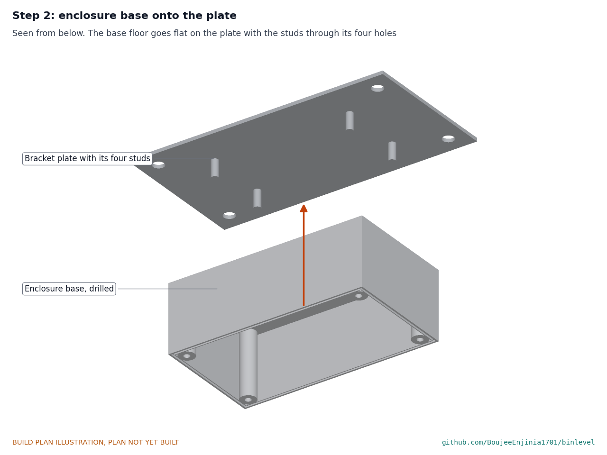

Hold the plate top face down on the bench. Put the base on it, floor down, with the four studs through the floor holes.

### Step 3: sealing washers and standoffs onto the studs

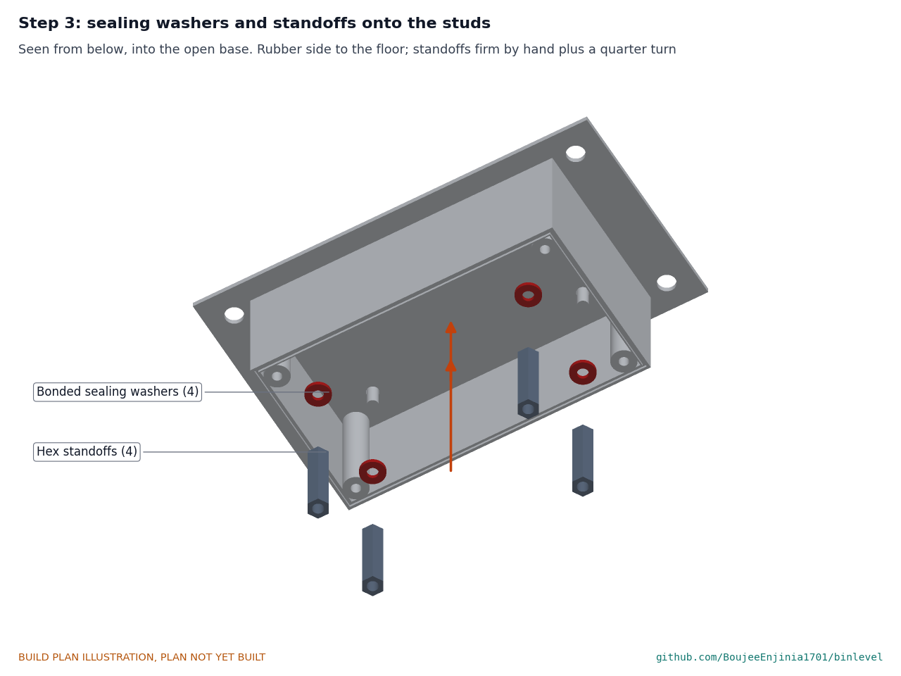

On each stud, inside the base: a bonded sealing washer, rubber side to the floor, then a 30 mm standoff, hand tight plus a quarter turn with a 7 mm spanner. **Hold point:** the base does not move on the plate when pushed by hand.

### Step 4: antenna onto the inner wall

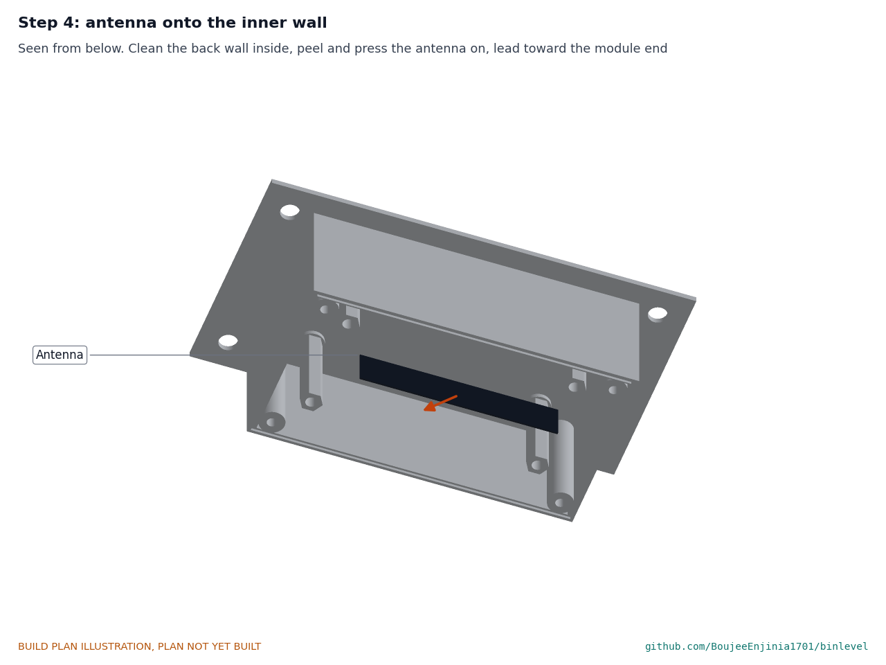

Clean the inside of the back wall with isopropyl alcohol on a cloth and let it dry. Peel the antenna and press it on, 3 to 15 mm from the floor, centred, with its lead toward the end where the radio module will sit.

### Step 5: build the electronics board

Solder the radio module, board sensors, power parts, capacitor and the cell holder (no cell) to the board as section 3.3 describes, then wire them as Figure 8. **Hold point:** safety stop S2 (section 6).

### Step 6: driver board under the board

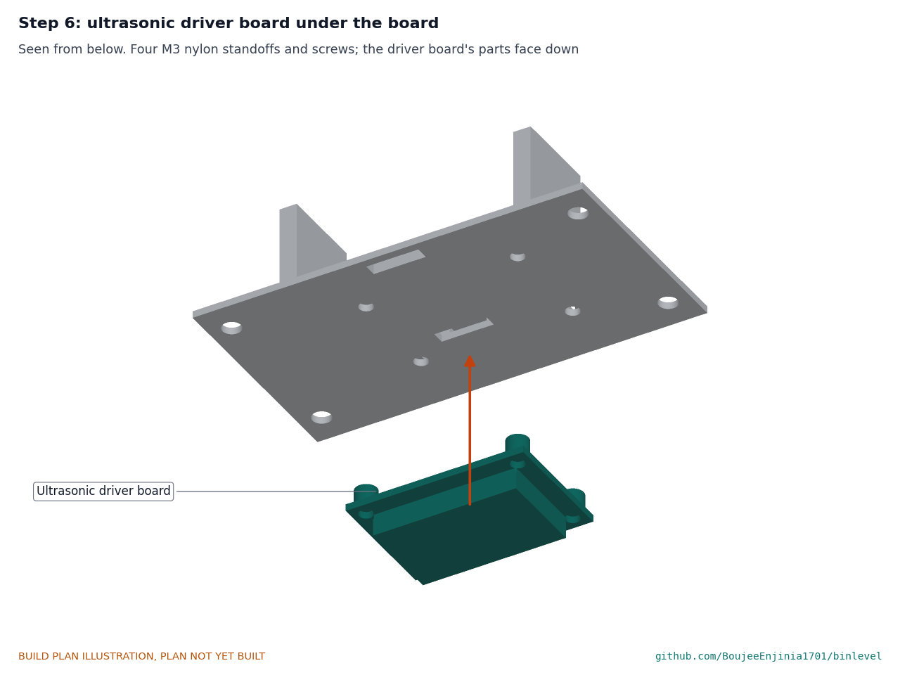

Four 4 mm nylon standoffs and M3 nylon screws, its parts facing down. Plug its supply, trigger and echo wires to the board.

### Step 7: cell and strap

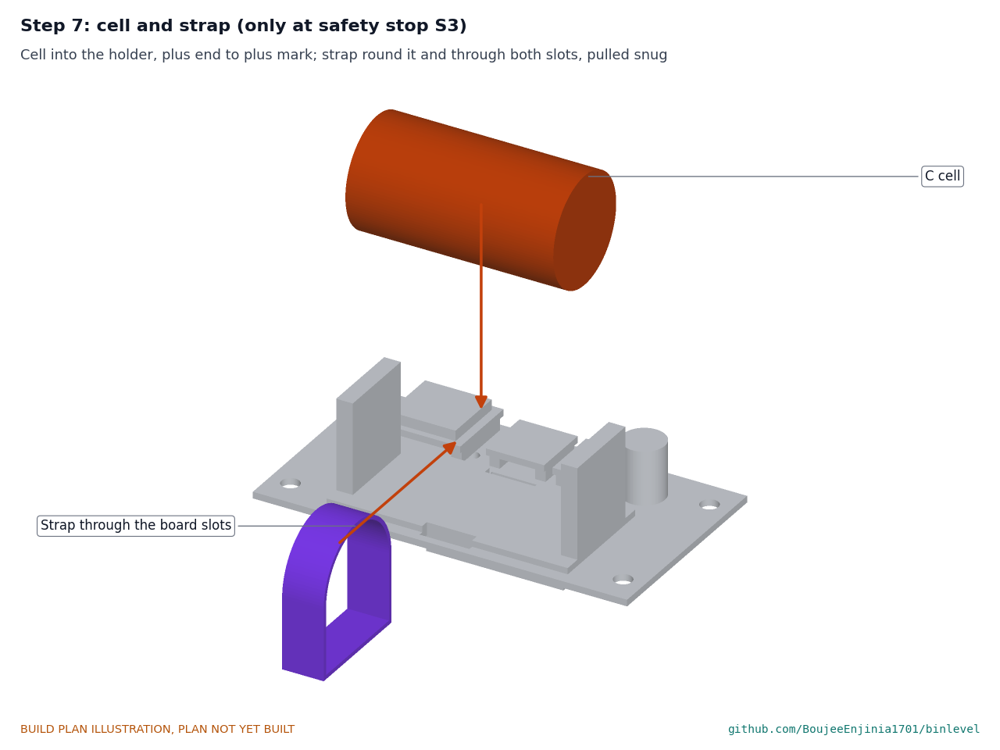

**Only at safety stop S3.** Put the cell in the holder with its positive end at the holder's plus mark, checked with a meter, not by colour. Pass the strap round the cell, through both slots and under the board, and pull it snug.

### Step 8: electronics board into the base

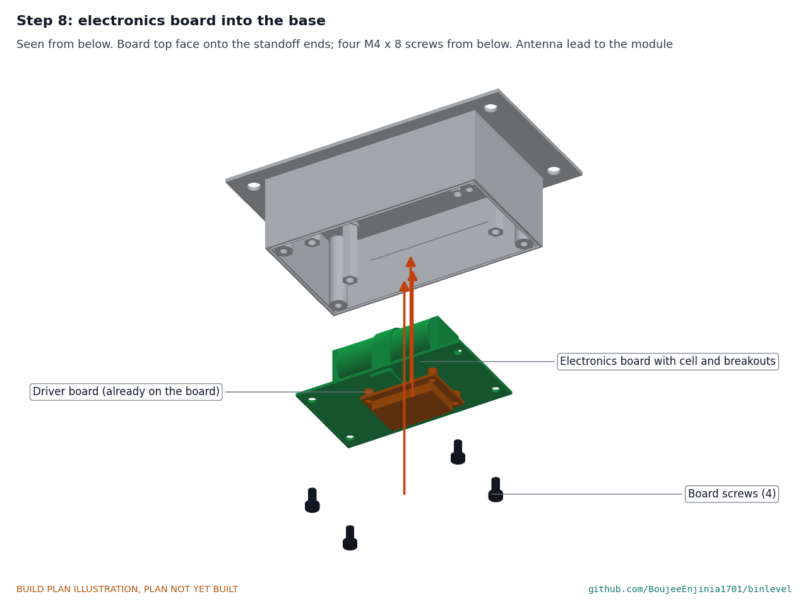

Plug the antenna lead into the module. Hold the board top face up into the base and fit four M4 x 8 screws through it into the standoffs. No wire may lie across the base rim.

### Step 9: transducer and collar into the cover

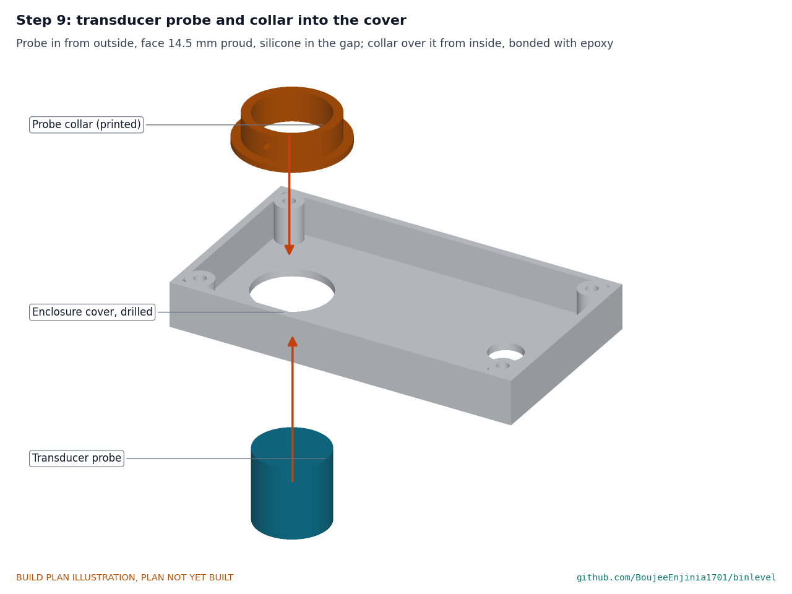

Push the probe through the 25 mm hole from outside until its face stands 14.5 mm proud of the cover. Run a bead of neutral-cure silicone round the probe in the hole. From inside, slide the collar down the probe onto the floor, its screw hole toward the front, and bond the flange to the floor with two-part plastics epoxy. Leave both to cure for 24 hours, then fit the grub screw finger tight.

### Step 10: window, holder and light sensor into the cover

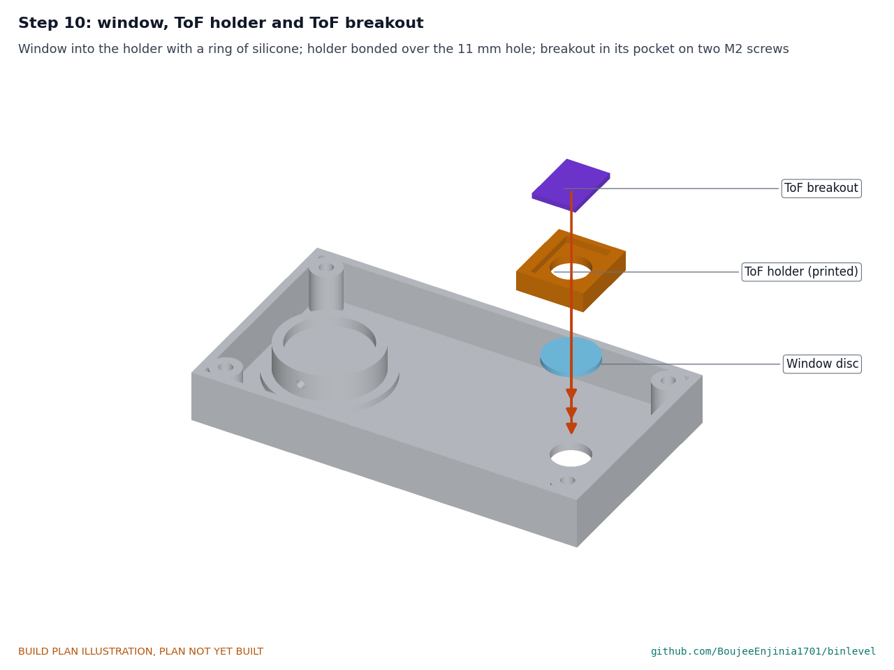

Peel the window film. Put a thin ring of silicone on the window's outer face and press it into the holder's recess. Bond the holder over the 11 mm hole with plastics epoxy, the window toward the floor, and leave it to cure. Fit the breakout in the top pocket, sensor down, with two M2 screws.

### Step 11: vent into the cover

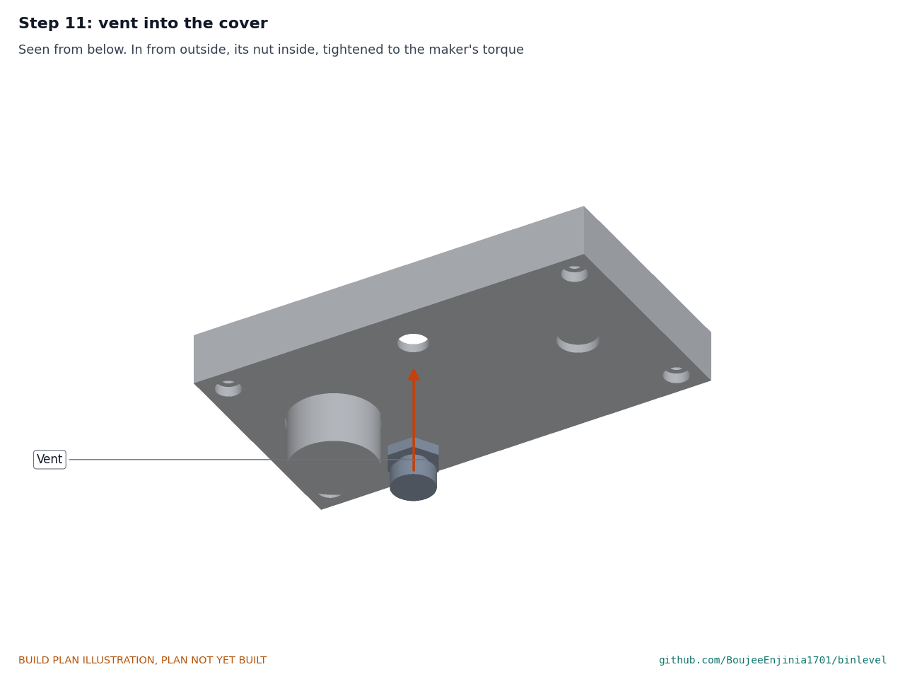

In from outside, its nut inside, tightened to the maker's torque.

### Step 12: close the cover

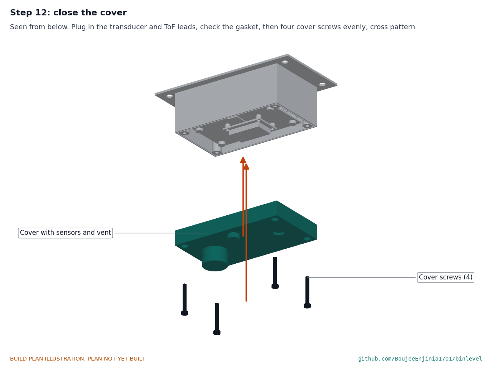

Plug the transducer cable into the driver board and the light sensor lead into its socket on the board. Check that the gasket is clean and seated in its groove with no wire across it. Offer the cover up and tighten the four cover screws evenly in a cross pattern. **Hold point:** safety stop S4 before the radio transmits.

### Step 13: unit onto the lid

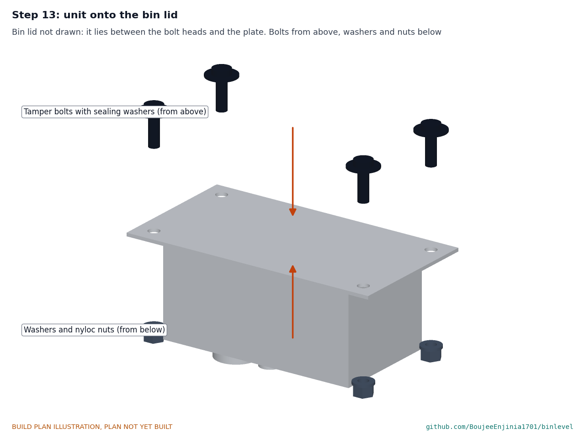

Drill the test lid through the plate's four bolt holes at 7 mm. Hold the plate flat against the lid's underside. From above, put a sealing washer on each bolt and pass it down through the lid and the plate; below, fit a plain washer and a nyloc nut. Hold each nut with a 10 mm open spanner from the side and tighten from above with the tamper driver. **Hold point:** safety stop S5.

## 5. First checks

These are the checks a TRL 4 test report would record; this plan only lists them. Requirement numbers are those of BNL-REQ-001.

*Table 3. First checks.*

| Check | Requirement | How | Pass when |
| --- | --- | --- | --- |
| Seals seated | R5 | Look at the gasket, the vent, the probe and the window under a lamp, cover closed | Gasket evenly squeezed all round; silicone bead unbroken; no gaps (the spray test comes later) |
| Size and mass | R16 | Measure the unit on the test lid; weigh it without the lid | 71.5 mm or less below the lid, within 150 x 80 mm; 400 g or less (about 350 g estimated) |
| Supply rails | R4, R6 | Cell out, bench supply at 3.6 V, current limit 50 mA, in place of the cell; measure the 3.3 V rail | 3.3 V, give or take 0.1 V; no part warm to the touch |
| Sleep current | R4 | Same supply, unit asleep, meter in series | About 6 µA (the calculation's figure); record the value |
| Sensors switched off in sleep | R4 | Measure the supply at the driver board and light sensor plug while asleep | 0 V |
| Ranging | R1 | Cell in, cover closed, unit face down above a flat board at 0.1, 0.3, 0.5 and 1.0 m | Light sensor reads 0.1 and 0.3 m, transducer reads 0.3 to 1.0 m, each within 20 mm |
| Tilt wake | R8 | Tip the unit through 90° | The module wakes and logs a tip event |
| Radio | R10, R15 | Unit near a gateway on the pilot region's band | Joins the network and sends an 11-byte uplink that the open decoder reads |
| Fixing | R7, R12, R13 | Fit the unit to the test lid with a stopwatch; try the bolt heads with an ordinary hex key | Fitted in 10 minutes or less; nothing moves when pushed by hand; the heads cannot be turned without the tamper driver |

## 6. Safety stops

Stop at each point. Carry on only when everything listed is true.

- **S1. Before the cell comes into the workshop.** The cell has its maker's data sheet; its voltage is about 3.6 to 3.7 V; it is not swollen, dented, leaking or warm. It is stored in its packaging away from metal objects, on a non-combustible surface, with dry sand or a Class D or lithium-rated extinguisher within reach; never water on a lithium metal cell.
- **S2. Before the board is powered for the first time.** No cell in the holder. The fuse is in the cell lead. With a meter, no rail reads a short to ground, and the holder's polarity matches the wiring. The bench supply is set to 3.6 V with a 50 mA current limit and connected at the holder's leads, never across the cell.
- **S3. Before the cell goes in.** The bench checks of section 5 (supply rails, sleep current, sensors switched off) pass. The bench supply is disconnected and stays disconnected while the cell is in: a supply connected across a primary cell would charge it, which can make it vent or burst. The strap is ready to go round the cell straight away.
- **S4. Before the radio transmits.** The antenna is plugged into the module and matches the pilot region's band. Transmitting without an antenna can damage the radio.
- **S5. Before the unit goes near a real bin (outside this plan).** Only on an emptied and cleaned container, with cut-resistant gloves and eye protection; drill swarf kept out of the container; clear of the lifting gear of collection trucks. The temperature alert is a maintenance aid and never fire detection.

## 7. Tools, skills and workspace

**Tools.** Hacksaw or bandsaw with a fine blade; bench vice with smooth jaws (or a small arbor press); bench drill or a drill in a stand; drills 1.5 to 7 mm; a step drill to 25 mm (or a 25 mm hole saw); M3 tap and tap wrench; deburring tool; flat and needle files; scriber, steel rule, engineer's square and calipers; 3D printer with an enclosure that prints ASA; temperature-controlled soldering iron, solder and flux; wire strippers; multimeter with a microamp range; bench power supply with an adjustable current limit; 7 mm and 10 mm spanners; small screwdrivers; the tamper-bolt driver; scale to 1 kg; stopwatch; mixing sticks and gloves for epoxy.

**Skills.** No certified trade is needed. Basic metalwork (marking out, drilling, filing, a press fit), careful drilling of thin plastic, through-hole soldering, safe use of a bench power supply and care with lithium metal cells. All circuits are extra-low voltage: 3.6 V at the cell and 3.3 V on the board. The bench supply must be a certified, undamaged unit; no mains wiring is part of this build.

**Workspace.** A bench about 1.2 x 0.6 m; a metalwork corner kept apart from the electronics so chips stay off the boards; a ventilated place for the printer, epoxy and silicone; the cell storage place of S1.

**Personal protective equipment.** Safety glasses for cutting, drilling and soldering; nitrile gloves for epoxy and silicone; cut-resistant gloves for sheet edges; no gloves near a turning drill.

## 8. Where the numbers come from

- Model and constructability checks: `cad/src/model.py` (`python cad/src/model.py --check`); STEP and STL exports in `cad/step/` and `cad/stl/`.
- Pictures: `cad/src/build_plan_media.py`, using `.kit/build_views.py`; written to `docs/05-build-plan/` and `cad/drawings/BNL-DWG-101` to `BNL-DWG-106`.
- General arrangement: `cad/drawings/BNL-DWG-001.pdf`, Rev P4.
- Calculations: `docs/04-calcs/01-sizing.md` (BNL-CAL-001 v0.3) and `docs/04-calcs/sizing.py`; geometry [A1] to [A3], mass and size [I1], [I3], fixing [J1] to [J3], cost [K1].
- Bill of materials: `bom/bom.csv`.
- Decisions: `docs/decisions/0003-design-for-construction.md` (BNL-DDR-003), with BNL-DDR-001 and BNL-DDR-002.
- Requirements: `docs/03-requirements.md` (BNL-REQ-001 v0.5).
